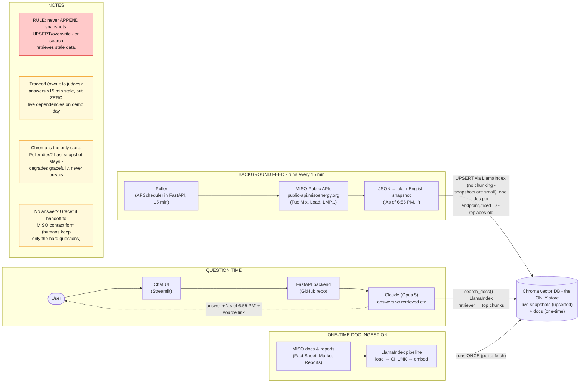

# MISO Copilot

An AI assistant that sits on top of [miso.org](https://www.misoenergy.org) and answers
plain-English questions about MISO's public data - so routine questions get answered in
seconds instead of becoming emails to MISO's CSR and External Affairs teams.

Built for the **Fall 2026 MISO Xtern Challenge** (TechPoint) - Prompt 1: *Intelligent
Navigation of MISO's Public Information*.



## The problem

MISO (the grid operator for 45M people in the central U.S.) publishes enormous amounts of
public data - live grid/market APIs, market reports, planning docs, filings - but none of
it is findable by a normal person. The site search is weak and the Market Reports section
has 11 categories of files with almost no filtering. So everyone from curious citizens to
utility analysts emails MISO's human teams instead.

**MISO Copilot deflects those routine questions**: ask in plain English, get an answer with
a source link, sourced from MISO's own public data.

## Architecture (pull-based RAG)

```
BACKGROUND (every 15 min)
  Poller → MISO public APIs → JSON→plain-English snapshot → UPSERT into Chroma (fixed IDs)

ONE-TIME
  MISO docs & reports → LlamaIndex pipeline (load → chunk → embed) → Chroma

QUESTION TIME
  User → Streamlit chat → FastAPI → Claude + LlamaIndex retriever → Chroma top chunks
       → answer + "as of <time>" + source link
```

Key design decisions:

- **Pull-based, not call-time**: no live API dependency at question time - the demo works
  even if MISO's APIs are down. Tradeoff: answers are ≤15 min stale (stated in every
  answer as "as of \<time\>").
- **UPSERT, never append**: one document per API endpoint with a fixed ID, overwritten
  each poll cycle, so retrieval can never surface a stale snapshot.
- **JSON → prose before embedding**: snapshots are stored as natural-language paragraphs
  ("As of 6:55 PM EST, total generation is 114,136 MW; natural gas leads with…") because
  prose embeds well and raw JSON doesn't.
- **Citations everywhere**: every answer carries its source URL - the link *is* the
  product for "where do I find X" questions.

## Stack

| Piece | Tech | Cost |
|---|---|---|
| Chat UI | Streamlit | $0 |
| Backend | FastAPI | $0 |
| RAG framework | LlamaIndex (ingestion, chunking, retrieval) | $0 |
| Vector store | Chroma (embedded, local persistence) | $0 |
| Embeddings | sentence-transformers (local, all-MiniLM-L6-v2) | $0 |
| LLM | Claude (Anthropic API) | pennies |
| Data | MISO public APIs (`public-api.misoenergy.org`, no auth) + public docs | $0 |

## Data sources

- **Live grid/market data**: [MISO Real-Time Data APIs](https://www.misoenergy.org/markets-and-operations/rtdataapis/)
  - FuelMix, RealTimeTotalLoad, WindSolar, MarketPricing (LMP), Interchange, outages, and
  more. Free JSON, no auth. Polled respectfully (≤1 request/endpoint/minute).
- **Documents**: MISO Fact Sheet, key site pages, Market Reports listings, help-center
  articles - fetched once, politely, at low volume. (Per MISO's guidance: no scraping.)

## Quickstart

**React UI (the demo frontend)** - a static MISO-style landing page with the Copilot
panel docked in the upper-right:

```bash
cd frontend
npm install
npm run dev        # http://localhost:5173
```

**Backend (FastAPI + Claude)**:

```bash
python -m venv .venv && source .venv/bin/activate
pip install -r requirements.txt
echo 'CLAUDE_API_KEY=sk-ant-...' > .env    # gitignored - never commit
uvicorn backend.main:app --reload --port 8000
```

**Streamlit UI (fallback / quick testing)**:

```bash
streamlit run app.py
```

The React dev server proxies `/ask` to `localhost:8000` (no CORS setup needed).
Without a key the backend returns 503 and the widget shows a graceful handoff to
MISO's contact form. The current backend sends every question straight to Claude
(Opus 5) with a MISO system prompt; the RAG store (Chroma + LlamaIndex) and the
15-min poller land next.

## Repo layout

```
frontend/                     # React (Vite) demo UI (see frontend/UI_RULES.md)
  src/copilot/                #   the Copilot chat panel (the product)
  src/fake-landingpage/       #   static MISO-style backdrop page
backend/                      # FastAPI app
  main.py                     #   app entry (uvicorn backend.main:app)
  config.py                   #   .env loading, model + URL constants
  routes/                     #   /ask and /health endpoints
  llm/                        #   Claude client + system prompt
  rag/                        #   (planned) Chroma + LlamaIndex retrieval
  poller/                     #   (planned) 15-min poller + JSON->prose summarizers
app.py                        # Streamlit chat UI (fallback; talks to the same backend)
docs/                         # architecture diagram: arch-v1.png + .excalidraw source
ingest/                       # (planned) one-time LlamaIndex document ingestion
data/                         # Chroma persistence (gitignored)
```

A full rendering of the architecture lives in [`docs/arch-v1.png`](docs/arch-v1.png);
to edit it, drag [`docs/architecture.excalidraw`](docs/architecture.excalidraw) into
[excalidraw.com](https://excalidraw.com).

## Team

Fall 2026 MISO Xtern Challenge - Prompt 1. Demo day: Sept 11, MISO HQ, Carmel, IN.
