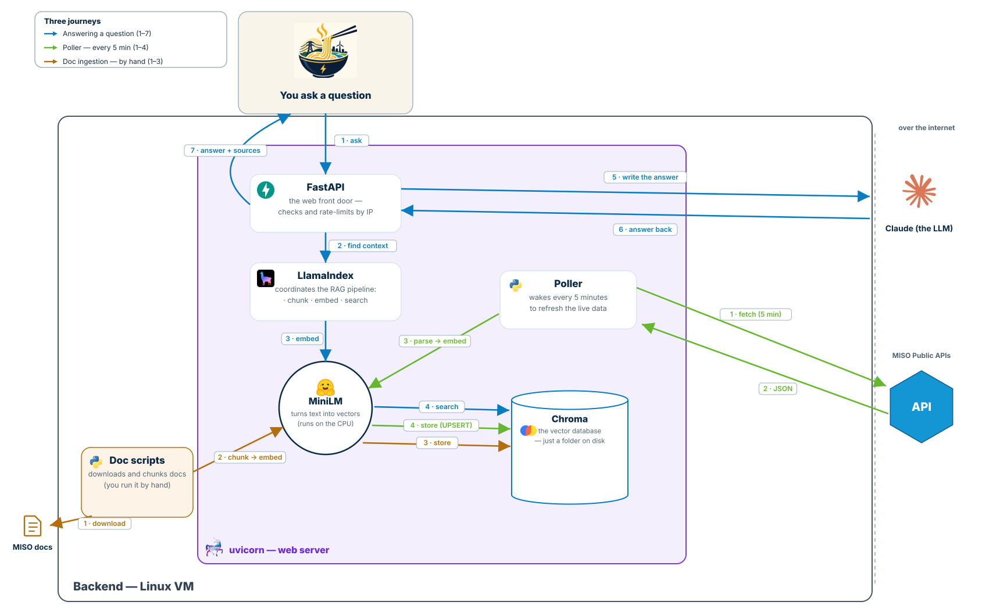

# MISO Copilot

An AI assistant that sits on top of [miso.org](https://www.misoenergy.org) and answers
plain-English questions about MISO's public data - so routine questions get answered in
seconds instead of becoming emails to MISO's CSR and External Affairs teams.

Built for the **Fall 2026 MISO Xtern Challenge** (TechPoint) - Prompt 1: *Intelligent
Navigation of MISO's Public Information* ([the full prompt, explained](docs/prompt.md)).

## The problem

MISO (the grid operator for 45M people in the central U.S.) publishes enormous amounts of
public data - live grid/market APIs, market reports, planning docs, filings - but none of
it is findable by a normal person. The site search is weak and the Market Reports section
has 11 categories of files with almost no filtering. So everyone from curious citizens to
utility analysts emails MISO's human teams instead.

**MISO Copilot deflects those routine questions**: ask in plain English, get an answer
with a source link, sourced from MISO's own public data. Live questions ("how much wind
right now?") are answered from MISO's APIs; "where do I find X?" questions are answered
from a small curated set of MISO's own documents - and the link is the answer.

## How it works



Want the full picture? A more detailed version lives in
[`docs/architecture-detailed.svg`](docs/architecture-detailed.svg)
([PNG](docs/architecture-detailed.png)).

The key design choice: **we never call MISO's API at question time.** A background
poller keeps a fresh local copy - every five minutes it refetches, then re-indexes
what it fetched - and questions are answered from that copy. If MISO's
API goes down mid-demo, the app keeps answering - it just says how old its data is
("as of 6:55 PM EST") right in the answer. Every answer links its source, because for
"where do I find X" questions, the link *is* the product. And the poller is hard-limited
to MISO's published rate (1 request per endpoint per minute) - no scraping, ever.

## Stack

Everything runs locally and free, except Claude API calls (pennies).

| Piece | Tech |
|---|---|
| Chat UI | React widget (Streamlit backup) |
| Backend | FastAPI |
| Retrieval | LlamaIndex + Chroma (local vector DB) |
| Embeddings | sentence-transformers, runs on-device |
| LLM | Claude (Anthropic API) |
| Live data | [MISO public APIs](https://www.misoenergy.org/markets-and-operations/rtdataapis/) - free JSON, no auth |
| Documents | 9 curated MISO pages and PDFs (fact sheet, Market Reports catalog, readers' guides, interconnection process) |

There are two UIs on purpose: the React app (`frontend/`) is the demo, and the
Streamlit app (`app.py`) is a one-command backup in case the demo machine has a bad day.

## Run it

Backend (Python 3.11 recommended):

```bash
python -m venv .venv && source .venv/bin/activate
pip install -r requirements.txt
echo 'CLAUDE_API_KEY=sk-ant-...' > .env    # gitignored - never commit
uvicorn backend.main:app --port 8000
```

Frontend:

```bash
cd frontend
npm install
npm run dev        # http://localhost:5173
```

Documents (once, with the backend stopped - about a minute):

```bash
python -m backend.rag.fetch_docs      # 9 polite downloads into data/docs/
python -m backend.rag.ingest_docs     # chunk them into Chroma with citations
```

That's it. On boot the backend loads the latest MISO snapshots into Chroma and starts
the 5-minute poller. Ask the widget "what's the current fuel mix?" and you'll get real
grid numbers with a chart, an "as of" time, and a source link. Ask "where do I find
historical LMP data?" and you'll get the right Market Reports category with links to
the readers' guides. (No API key? The backend returns a graceful handoff to MISO's
contact form instead of an error.)

Backup UI: `streamlit run app.py`. Tests: `pytest` (634 tests on the poller, 100%
branch coverage).

## Repo layout

```
frontend/          # React demo UI: landing page + Copilot chat widget
backend/
  routes/          #   /ask and /health
  llm/             #   Claude client + system prompt
  rag/             #   JSON -> prose -> Chroma, doc corpus -> Chroma, retrieval
  poller/          #   5-min poller with a hard rate guard
app.py             # Streamlit backup UI
tests/             # poller test suite
docs/              # architecture diagrams (simple + detailed + cloud reference)
infra/             # Terraform sketch of a future cloud deployment - reference only
data/              # local data + vector store (gitignored)
```

For contributor rules and the full architecture constraints, see
[`AGENTS.md`](AGENTS.md). Design rules for the UI live in
[`frontend/UI_RULES.md`](frontend/UI_RULES.md).

## Maybe / later

- **Answer caching** - answers can't change between poll cycles, so repeated
  questions could skip the Claude call.
  - holds recent question &rarr; answer pairs in memory
  - checks the cache before calling Claude
  - clears itself whenever the poller brings fresh data
- **MCP server** - let other people's AI assistants automate on our data.
  - a small server that speaks MCP (the open standard AI tools use)
  - exposes tools like `get_fuel_mix()` and `search_miso(question)`
  - reads our local snapshots only - never hits MISO's API directly, so
    anyone can automate freely and MISO sees zero extra traffic
  - connects to Claude Desktop / Claude Code / Cursor out of the box

## Team

Fall 2026 MISO Xtern Challenge - Prompt 1. Demo day: Sept 11, MISO HQ, Carmel, IN.
