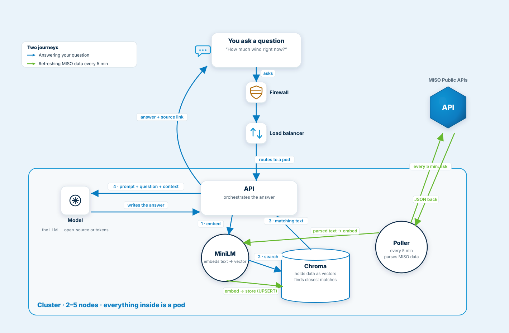

# infra/ — reference cloud deployment

**Nothing here is deployed.** This folder is a sketch of how MISO Copilot
*could* run in the cloud, written as real, validated Terraform (`terraform
validate` passes, azurerm ~> 5.4). It exists to show the path from
laptop-demo to production — for the presentation and for future work.



(Also as a [PNG](../docs/terraform-architecture.png).)

## What maps to what

| Local (today) | Cloud (this file) |
|---|---|
| `uvicorn` on a laptop | Container App running the FastAPI image |
| React dev server | Static Web App serving the built frontend |
| `data/` folder on disk | Azure Files share mounted at `/app/data` |
| `.env` with the API key | Key Vault secret, read via managed identity |
| `/tmp/miso-backend.log` | Log Analytics workspace |

## The one rule that carries over

The Container App is pinned to **exactly one replica** (`min_replicas =
max_replicas = 1`). That's not a cost choice — the poller's rate guard is a
local file and its scheduler must never run twice, same as the "one worker,
one machine" rule in `AGENTS.md`. Scaling reads would mean splitting the
poller into its own single-instance job first.

## If someone ever did apply this

```bash
cd infra
export TF_VAR_claude_api_key=sk-ant-...   # never commit
terraform init
terraform plan
```

It would also need a CI job that builds the backend Docker image and pushes
it to GHCR — that pipeline isn't set up, which is one more reason this
folder is documentation, not a deployment.
